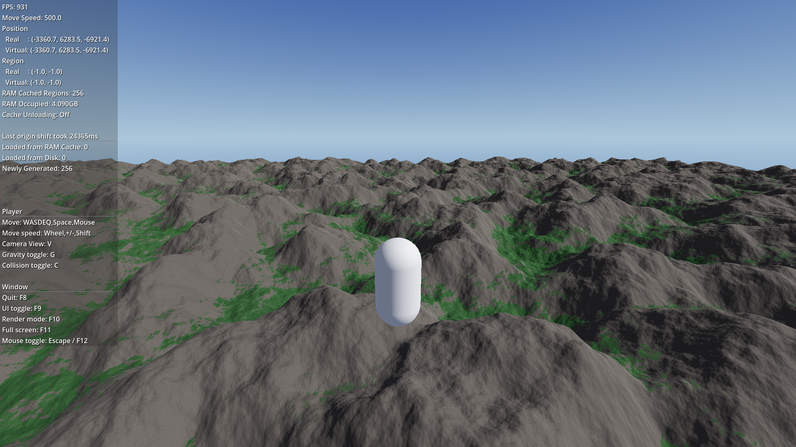

# Terrain3D - Infinite Procedural Demo

An adaptation of the [*Terrain3D* CodeGenerated demo](https://github.com/TokisanGames/Terrain3D/blob/main/project/demo/src/CodeGenerated.gd) to emulate infinite, procedural terrain via region origin shifting, using pure *GDScript*.

## Installation
- This project was made using *Godot 4.5.1-stable* and *Terrain3D 1.0.1*. If there are issues in earlier versions, you may need to upgrade.
- Download the project to your desired location.
- Add the Terrain3D plugin to the `root/addons` folder.
  - If you are downloading the *Terrain3D* plugin from the assets library from within *Godot*, the included original demo project causes conflicts. Make sure to only add the plugin itself.
 
## Usage
- You can configure the terrain generation and data storage parameters in the main `InfiniteProceduralDemo` node via the Inspector.
- The player speed is set to 500 units/meters per second by default. This is for demonstration and testing, but may make the terrain feel smaller than it actually is. Your game will probably not allow players to move this fast, unless you're giving them supersonic fighter jets.
- Caching heightmaps and saving them to disk allows speed increases at the cost of RAM/disk space. See the docstrings or tooltip descriptions in the Inspector for details.
  - When saving to disk, don't forget to delete the data when you change the terrain generation parameters! Alternatively, select different directories for different parameters.
 
## Caveats
- This project may become obsolete once *Terrain3D* gets official [Region Streaming Support](https://github.com/TokisanGames/Terrain3D/issues/491).
- This project is a prototype and not well optimized/refined yet.
- Navigation and foliage instancing from the original are *not* included.
- While this works in *GDScript*, heightmap generation from noise is very inefficient, and directly using C++ for this is faster. Alternatively, a compute shader may also speed this up.
- This was tested using a *Ryzen 7 9800X3D* and *RTX 5070 Ti*. Your mileage may vary, especially when using smaller `vertex_spacing` and generating lots of regions around the player.
- Origin shifts are not completely seamless:
  - Generating/loading regions and origin shifting currently happen together, causing new terrain to pop in. You may want to restrict the render distance to hide this, and/or use more dynamic and independent preloading of distant regions.
  - This also means that while you *can* generate and render the full 32x32 region grid, the new regions beyond that can only be rendered *after* the origin shift, causing additional pop in.
  - There may be smaller hitches when the origin shift is applied to the regions and player position.
  - The terrain texturing shader code wasn't changed and is still based on the actual global position, not the virtual, infinite coordinate system. As such, texture offsets change during origin shifts.
  - You need to also origin shift any nodes you are using besides the player. Origin shifting may also cause physics glitches you need to account for.
## License
This project is licensed under the *MIT* license, see [LICENSE](LICENSE) for details.

The code is derived from the original [*Terrain3D* CodeGenerated demo](https://github.com/TokisanGames/Terrain3D/blob/main/project/demo/src/CodeGenerated.gd), see [LICENSE_ORIGINAL](LICENSE_ORIGINAL).

 
